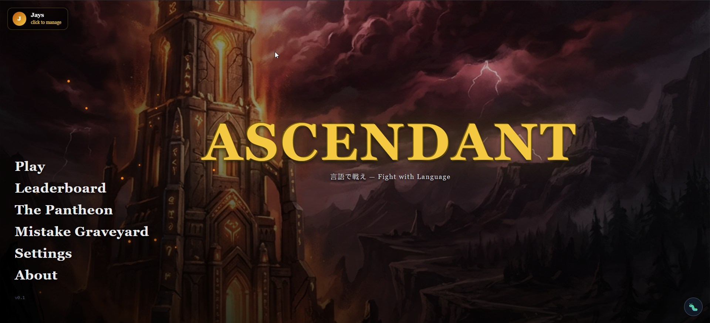
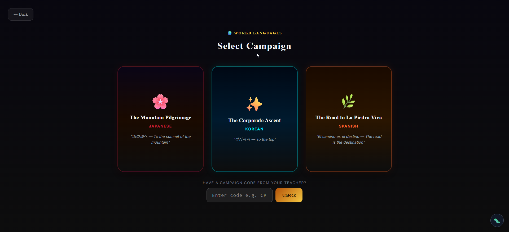
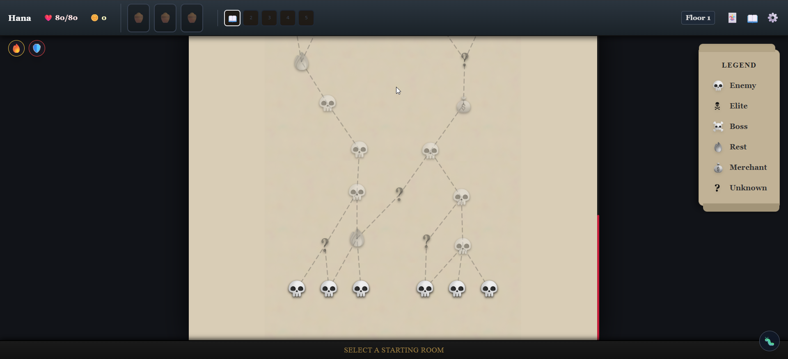
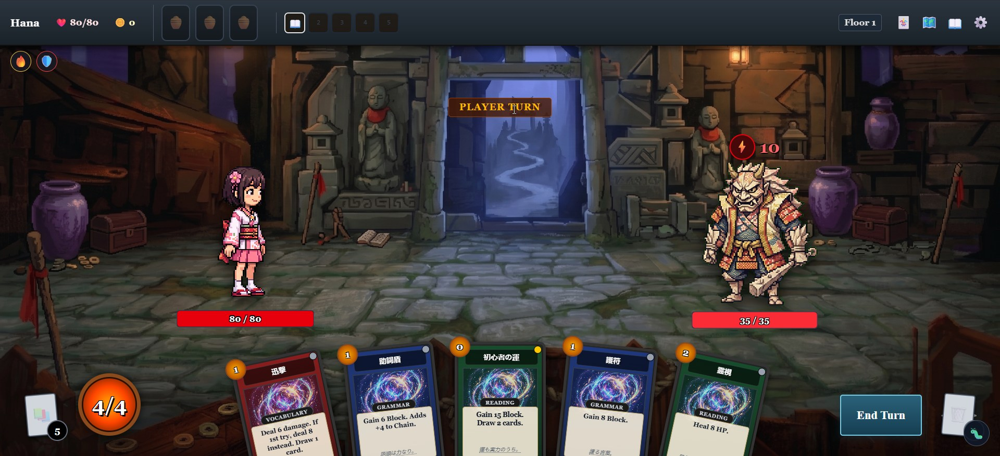
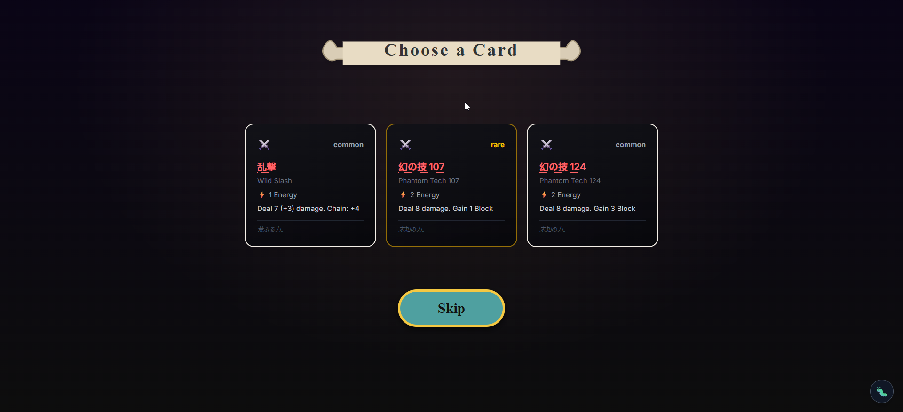
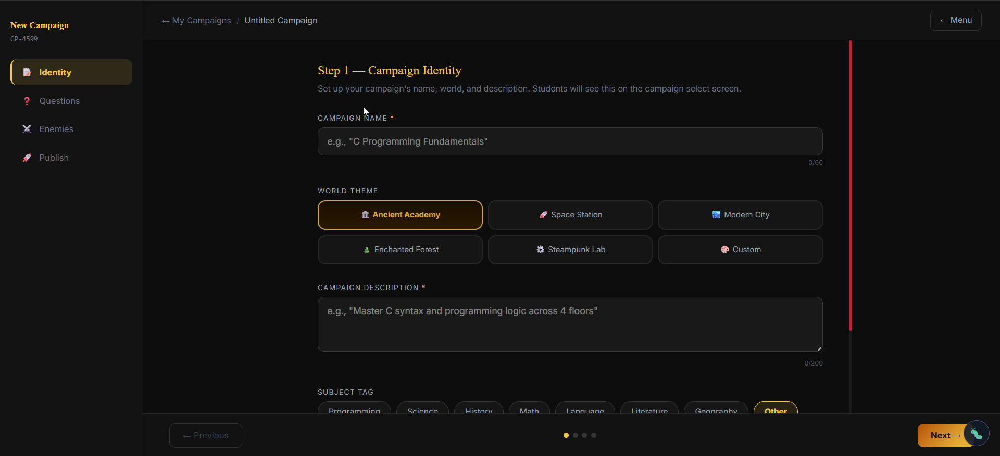
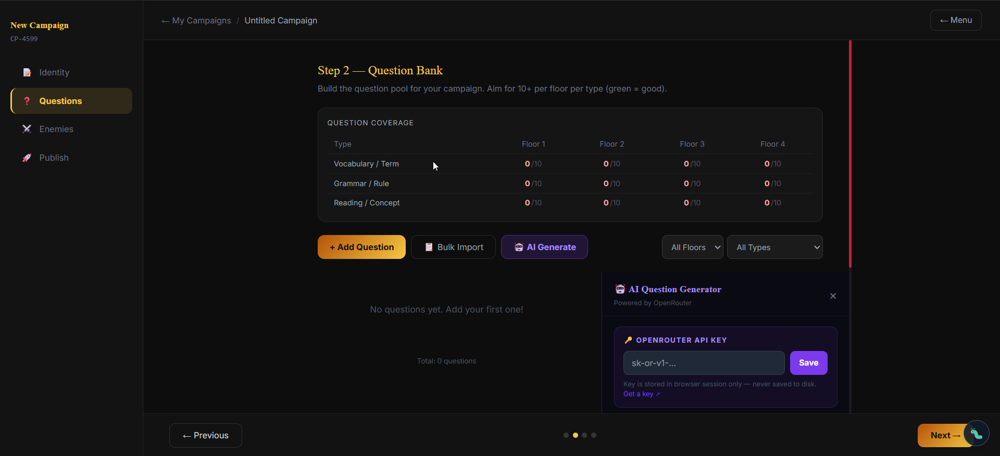
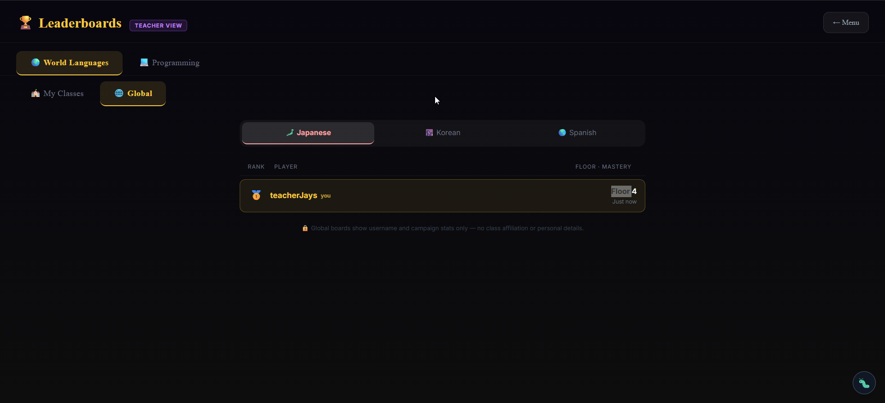

# Ascendant-Language-Learning-Game

> A roguelike deck-building RPG that teaches language vocabulary, grammar, and programming concepts through strategic card-based combat.

---

## Project Information

| Field | Details |
|-------|---------|
| Subject | Web Systems and Technologies |
| Academic Year | 2025-2026 |
| Project Category | Web Development / Game Development / Educational |
| Instructor | Ma'am Divine Grace Caabay |

### Members

* Jophil F. Gulane
* Vougne Froid P. Alis

---

## Project Description

Ascendant is an educational single-player card RPG built to make learning interactive and engaging. Inspired by roguelike deckbuilders like *Slay the Spire*, players must ascend a mountain by defeating enemies using cards that represent vocabulary, grammar, and reading skills. To successfully play a card, the player must correctly answer a randomized educational prompt. 

The game is designed for language learners and programming students who want a gamified, strategic way to drill flashcard concepts without the boredom of traditional study methods. It features a robust Custom Campaign and Lesson Builder, allowing teachers to create and publish their own custom subject modules, complete with AI-generated questions.

---

## Features

* **Roguelike Deck-building Combat:** Draft cards, build synergies, and manage energy to defeat challenging enemies.
* **Dynamic Educational Mechanics:** Cards require correct answers to deal damage or block attacks.
* **Multiple Built-in Campaigns:** Study Japanese, Korean, Spanish, C, Python, and JavaScript.
* **Teacher Lesson Builder:** Create custom campaigns with custom vocabularies and questions.
* **AI Question Generator:** Integrated OpenRouter AI automatically generates contextual questions for your custom campaigns.
* **Campaign Codes:** Unlock special custom campaigns shared by teachers using unique CP codes.

---

## Technologies Used

* React.js
* Vite
* Tailwind CSS
* Zustand (State Management)
* Framer Motion (Animations)
* OpenRouter API (AI Integration)

---

## Installation Guide

> Follow these steps to run the Ascendant game locally on your machine.

1. Clone the repository

```bash
git clone https://github.com/PSU-CS-Academic-Projects/Ascendant-Language-Learning-Game.git
```

2. Navigate into the project folder

```bash
cd Ascendant-Language-Learning-Game
```

3. Install the dependencies

```bash
npm install
```

4. Run the development server

```bash
npm run dev
```

5. Open your browser and navigate to `http://localhost:5173` to play!

---

## Screenshots

> Upload your screenshots inside the `screenshots/` folder and reference them here.

**Main Menu & Mode Selection**
*The entry point of the game where players select between Language or Programming modes.*


**Character & Campaign Select**
*Players choose their character and specific subject campaign to study.*


**Map Navigation**
*Branching paths where players choose their route through elite enemies, rest sites, and events.*


**Strategic Card Combat**
*The core gameplay loop. Players play cards and answer educational prompts to deal damage or block.*


**Loot & Card Drafting**
*Drafting new cards to build powerful synergies after winning a battle.*


**Teacher Dashboard & Lesson Builder**
*The dedicated portal for educators to create custom campaigns and manage flashcards.*


**AI Question Generator**
*OpenRouter AI integration allowing teachers to instantly generate educational questions.*


**Post-Run Summary & Leaderboards**
*The Graveyard and Leaderboard screens showing run statistics and high scores.*


---

## Live Demo

* Live URL: https://ascendant-mocha.vercel.app/

---

## Video Demonstration

* Video Link: https://your-video-link-here.com (Optional)

---

## Future Improvements

* Multiplayer or leaderboard system for classroom competition
* Expanded database of built-in programming language campaigns
* Advanced boss mechanics and custom enemy sprite uploads for teachers
